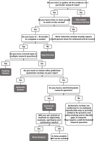

# Publication Types {#sec-publicationtypes}

## Reviews {#sec-review}

There are several types of reviews which differ in scope, purpose, target 
audience and amount of work involved.(@Sutton2019, @Munn2018a, @Munn2018) 
Among them the most prominent types are:

- Narrative / traditional review
- Scoping review (ScR)
- [Systematic review](#sec-sysrev) (SR)
- [Rapid review](#sec-rapidrev) (RR)
- Umbrella review

The free online tool ['Right Review'](https://whatreviewisrightforyou.knowledgetranslation.net/) 
is designed to provide guidance and supporting material when choosing any kind 
of knowledge synthesis.

@fig-decisiontree shows a decision tree to help find the right kind of review.

{#fig-decisiontree width=80%}

### rapid review {#sec-rapidrev}

**Rapid reviews** (RR) are a quicker alternative to the traditional 
[systematic review](#sec-sysrev) (SR) and are usually conducted in cases where 
decision makers require synthesized evidence in a time frame insufficient for a 
full SR and where limitations due to methodological shortcuts are acceptable.

::: {.callout-note title="Cochrane Definition"}
The [Cochrane Rapid Reviews Methods Group](https://methods.cochrane.org/rapidreviews/)
recommends the following definition (@Garritty2024a):

> A rapid review is a type of evidence synthesis that brings together and 
summarises information from different research studies to produce evidence for 
people such as the public, healthcare providers, researchers, policy makers, 
and funders in a systematic, resource efficient manner. This is done by speeding
up the ways we plan, do, and/or share the results of conventional structured
(systematic) reviews, by simplifying or omitting a variety of methods that 
should be clearly defined bythe authors."

:::

::: {.callout-note title="Methodology"}
There is a series of publications from the [Cochrane Rapid Reviews Methods Group](https://methods.cochrane.org/rapidreviews/)
which provides methodological guidance in conducting rapid reviews:

- Assessing the appropriateness of conducting an RR (@Garritty2025)
- Guidance on team considerations, study selection, data extraction and risk of bias assessment (@NussbaumerStreit2023)
- Guidance on literature search (@Klerings2023)
- Guidance on rapid quality evidence synthesis (@Booth2024)
- Interim guidance for the reporting of RRs (@Stevens2024)
- Guidance on assessing the certainty of evidence (@Gartlehner2024)
- Considerations and recommendations for evidence synthesis in rapid reviews (@King2024)
- Involving different stakeholders as knowledge users (@Garritty2024)
- Guidance on the use of supportive software (@Affengruber2024)
- Guidance on rapid scoping, mapping and evidence and gap maps (@Campbell2025)
:::

### systematic review {#sec-sysrev}

A **systematic review** (SR) is a comprehensive review of the best available 
evidence (i.e. all relevant research results) pertaining to a certain topic or 
research question. SRs are usually conducted by research groups over the time of
several months. The purpose of SRs is to inform evidence-based decision making.

SRs are regarded as the gold standard in evidence synthesis due to the strict 
and rigorous methodology that should be followed by the SR project team.

In many cases a so-called **meta-analysis** is also performed, which quantifies
the results of the systematic review. (See @Murad2014, @Nagendrababu2020, @Mulrow1994)

::: {.callout-tip title="Recommended reading"}
- *Doing a Systematic Review* by @Cherry2024  
- *Systematic Reviews in Health Research* by @Egger2022  
- *An Introduction to Systematic Reviews* by @Gough2017
:::