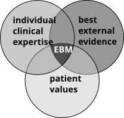
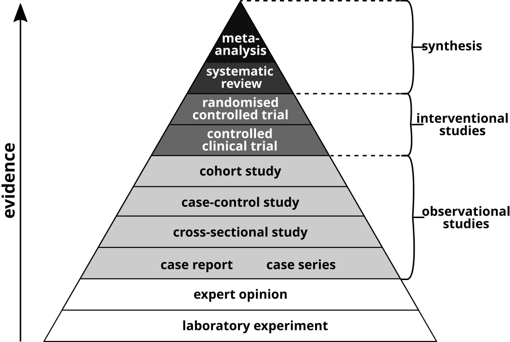

# Technical terms {#sec-technicalterms}

## abstract {#sec-abstract}
An abstract is the short summary at the beginning of scientific publications, 
e.g. journal articles, theses or conference papers. The abstract is among the 
most important parts of a publication as it is usually the only part of the 
text which is freely available and can be retrieved from bibliographic 
databases. Title and abstract are the key elements of a textword search. 
(@Cals2013, @Pitkin1998)


## ambiguity {#sec-ambiguity}
A term or statement which has more than one possible meaning or definition is 
ambiguous. Ambiguity proves to be an obstacle in creating search strategies, 
because any free text search with ambiguous terms will inevitably retrieve 
records for all meanings of the term regardless of the context. In this case, it
is an option to render such terms more specific by using phrases or proximity 
operators.

::: {.callout-tip title="Examples"}
1. The acronym `CVD` is a very common abbreviation for *cardiovascular disease*. 
However, it can also mean *cerebrovascular disease*, *chronic venous disease*, 
*color vision deficiency* or *chemical vapour deposition*.
2. The term `pharmacy` may refer to the pharmaceutical sciences, the manufacture
of drugs or the pharmacy as a retail shop.
3. In anatomy, a `styloid process` is a pointed outgrowth from a bone. However, 
there are serveral of these in the human body, for instance in the temporal
bone, the radius bone, the ulna bone or the metacarpal bones.
4. The search term `crab` might lead to articles about one of two very different
kinds of arthropods: True crabs 
([Brachyura](https://www.ncbi.nlm.nih.gov/mesh/68003386)) or crab lice 
([Phthirus](https://www.ncbi.nlm.nih.gov/mesh/68020061)).
:::

## appendix {#sec-appendix}
An appendix provides additional content to a publication and is often called
_supplementary material_ or _supplementary information_. Usually any content
which goes beyond the constraints of the publication is provided 
there. Examples are the full search strategies of systematic literature 
searches, detailed descriptions of methods or measurements. 

It is also possible to publish such supplementary information or research data
independently in online repositories.

## author keyword {#sec-authorkeywords}
Publishers often require the authors of a publication to provide keywords 
describing the content of the publication. These keywords don't necessarily 
correspond to [controlled vocabulary](#sec-thesaurus) (i.e. index terms, 
which are assigned to the records by the database) and should not be confused 
with them. (@Neveol2010)

Author keywords are often used as part of the free text search. (DE: *Stichwortsuche*)

::: {.callout-tip title="Examples"}
Within PubMed the [data field](#sec-datafield) `[Other Term]`) 
can be searched for author keywords. This field is automatically searched 
when `[Title/Abstract]` or `[Text Word]` are used. (See [PubMed Search Field Tags](https://pubmed.ncbi.nlm.nih.gov/help/?otool=ichsublib#ot)).

In Ovid MEDLINE the corresponding field codes `.kw` or `.kf` can be used for 
searching the author keywords.
:::

## bias {#sec-bias}
Bias is a systematic deviation between results and facts that may lead to under-
or over-estimation of intervention effects. As a result bias might lead to 
conclusions which do not accurately represent the truth. There are various types
and sources for bias, as well as methods to avoid some forms of bias, such as 
randomization or blinding of participants in clinical trials. 

Systematic literature searching is a means to reduce bias. Systematic reviews 
strive to minimise these deviations by assessing the risk of bias in results of 
included studies. (@Braun2021, @Boutron2022, @Gough2017)

### selection bias
Systematic differences between comparison groups lead to a deviation from the
true effect of an intervention. This so-called selection bias can be prevented 
by measures such as the sufficient randomization and concealment of allocation
of trial participants to different study arms.(@Gough2017, @OdgaardJensen2011)

### publication bias
Results perceived as "positive" are more likely to be published than those 
results which are perceived as "negative", which gives the positive results more
weight. (@Gough2017)

### language of publication bias
In systematic literature searches it is often tempting to restrict the search 
to languages which are easily understood by the screeners and researchers. 
Not only will this practive keep the number of records at a more manageable 
level, it also makes the translation of foreign publications unnecessary. 
However, this so-called language of publication bias can have a significant 
impact on the quality of the review. (@Gough2017, @Morrison2012, @Moher2003)


## BibTeX {#sec-bibtex}
**BibTeX** is a bibliographic file format which is supported by most [reference management programs](#sec-refmanagement), in particular [JabRef](https://www.jabref.org/), which supports it natively, and it is often available as an export format in [bibliographic databases](#sec-bibdb) and on publisher websites. BibTeX files possess the file extension `.bib`.

:::{.callout-tip title="Example: BibTeX format"}
```
@article{watson2020,
  author   = {Watson, Mandy},
  journal  = {Br J Nurs},
  title    = {How to undertake a literature search: a step-by-step guide},
  year     = {2020},
  note     = {PMID: 32279549},
  number   = {7},
  pages    = {431--435},
  volume   = {29},
  abstract = {Undertaking a literature search can be a daunting prospect. Breaking the exercise down into smaller steps will make the process more manageable. This article suggests 10 steps that will help readers complete this task, from identifying key concepts to choosing databases for the search and saving the results and search strategy. It discusses each of the steps in a little more detail, with examples and suggestions on where to get help. This structured approach will help readers obtain a more focused set of results and, ultimately, save time and effort.},
  doi      = {10.12968/bjon.2020.29.7.431},
}
```
:::


BibTeX is also the name of a software package used to typeset references in [LaTeX](https://www.latex-project.org/). The references of this compendium are also managed and processed using the BibTeX format.


## bibliographic database {#sec-bibdb}

**Bibliographic databases** comprise references to publications, such as articles in 
peer-reviewed journals, reports, patents, book chapters or conference proceedings. 

As opposed to full text databases, bibliographic databases only provide 
bibliographic information or metadata. Bibliographic records typically include 
title, abstract, author(s), publication year, journal name, and the DOI or 
other persistent identifiers.

References in bibliographic databases are often indexed with subject headings
to facilitate the retrieval of relevant records, for instance during a 
systematic literature search.


## classification metrics {#sec-class-metrics}

In information retrieval the performance of a systematic search, a search
strategy or a search filter is described by certain metrics for binary 
classification tasks, such as **accuracy**, **precision**, **sensitivity** 
and **specificity**.

A classifier (the search) makes a prediction about the condition of a record 
(by retrieving or not retrieving the record). The classification (the search 
result) is evaluated by comparing the prediction with the actual condition (the 
relevance of the records).

In other words: The literature search is supposed to retrieve mostly relevant 
references and ignore non-relevant ones. A retrieved relevant record equals a
true positive (*tp*), whereas a retrieved non-relevant record equals a false 
positive (*fp*). See @tbl-truth for reference.

::: {#tbl-truth}
|   **record**    | relevant | irrelevant |
|:---------------:|:--------:|:----------:|
|    retrieved    |   _tp_   |    _fp_    |
|  not retrieved  |   _fn_   |    _tn_    |
: Truth table {.striped}
:::


### accuracy {#sec-accuracy} 
**Accuracy**, also called **fraction correct (FC)**, is a statistical measure of
how well a binary classifier correctly ("true") identifies a condition 
("positive or negative"). It is defined as the ratio of all true 
classifications (true positives and true negatives) to the total number of
classifications. (@Haynes2004,  @Lefebvre2017, @Fawcett2006)

It can be calculated according to the following equation:
$$
\text{accuracy} = \tfrac{tp + tn}{tp + fp + fn + tn}
$$


### precision {#sec-precision}
**Precision**, also called **positive predictive value (PPV)**, is a performance 
metric for the retrieval of information. It is the fraction of all relevant 
records among all retrieved records, which can be written as:

$$
\text{precision} = \tfrac{tp}{tp + fp}
$$

A high-precision search tries to retrieve as few non-relevant records as 
possible, usually missing out on relevant records.


### sensitivity {#sec-sensitivity}

**Sensitivity**, also called **true positive rate (TPR)**, **recall** or 
**hit rate**, is a performance metric for the retrieval of informaton, similar 
to the *precision*. It equals the probability with which relevant records are 
correctly identified. (See @Haynes2004, @Lefebvre2017).

It is the ratio of all relevant retrieved records and the total of all relevant 
records:
$$
\text{sensitivity} = \tfrac{tp}{tp + fn}
$$
The idea of a sensitive search is to retrieve as many relevant records as 
possible, which results in retrieving more non-relevant records in the process.


## data field {#sec-datafield}
A data field (also called *field* or *column*) is a set of values of a 
particular data type within a database. For instance the data fields for the
author or the title contain text strings whereas the fields for the issue, 
volume or [PubMed ID](#sec-pmid-pmcid) contain numerical values. 

Data fields possess designations in the form of [field codes or search field tags](#sec-fieldcode) 
such as `PMID`, `AU`, `TI` and `AB` for the fields of unique identifier, author, 
title and [abstract](#sec-abstract). 

::: {#tbl-datafields}
|    PMID  |             AU            |                   TI                   |
|:--------:|:-------------------------:|:--------------------------------------:|
|  7616995 | J. P. Kassirer, M. Angell | Redundant publication: a reminder      |
| 16040884 |       A. K. Akobeng       | Principles of evidence based medicine  |
| 22071866 |   T. Young, S. Hopewell   | Methods for obtaining unpublished data |
: Data fields PMID, AU, TI shown for three records {.striped}
:::

It always depends on the [syntax](#sec-syntax) of the database or search
interface which fields can be searched and by what code they are searchable.

## dataset {#sec-dataset}

**Datasets** or **records** of a database are collections of data. In a tabular 
database they correspond to the rows of the table, as shown in @tbl-datafields.
A record in such a database consists of values for the given columns or
[data fields](#sec-datafield) of the table.

Records of bibliographic databases are called references. These contain the 
metadata referring to a publication, such as title, [abstract](#sec-abstract), 
authors, journal name or publication date.

Datasets within [clinical trials registries]({#sec-ctr}) contain metadata for 
clinical trials, such as registration number, study type, research institution, 
study status, etc.

Records within fulltext databases also feature a fulltext document, as opposed 
to bibliographic databases.


## digital object identifier {#sec-doi}
A digital object identifier (**DOI**) is a persistent identifier issued by the 
[DOI foundation](https://www.doi.org/). It is used to uniquely identify publications. 

DOIs take the form of character strings which consist of a prefix and a suffix, 
separated by a slash `/`. The prefix identifies the registrant of the DOI
(usually the publisher of an article) and takes the form `10.xxxx`, where `xxxx` 
is a number greater than or equal to 1000. After the prefix and the slash follows 
the suffix, which is chosen by the registrant for the particular digital object. 

DOIs can be resolved using the website of the
[International DOI Foundation](https://www.doi.org) or the 
[Handle.Net Registry](https://hdl.handle.net).

::: {.callout-tip title="Example"}
`doi:10.1000/182` can be resolved via <https://doi.org/10.1000/182> or 
<https://hdl.handle.net/10.1000/182> and leads to the [DOI handbook](https://www.doi.org/the-identifier/resources/handbook/).
:::

## eligibility criteria {#sec-eligibilitycriteria}
A very important step at the beginning of any review project is the definition
of certain **eligibility criteria** on the basis of the research question. 
There are two types of criteria: 

**Inclusion criteria** must be met by studies in order for
them to be included in the review. In contrast, if a study meets one or more 
of the **exclusion criteria**, it will be excluded from the review.
See also @McKenzie2022, @Gough2017.

::: {.callout-tip title="Example: systematic review about chronic non-cancer pain"}
- Inclusion criteria:
  - adults (18 years or older)
  - patients with chronic non-cancer pain
  - randomized controlled trials
- Exclusion criteria: 
  - acute pain, post-surgical pain 
  - chronic cancer pain
  - pregnancy
:::

## evidence {#sec-evidence}

**Scientific evidence** or simply **evidence** is information obtained by conducting 
experiments or by analyzing empirical data in accordance with the scientific
method. Scientific evidence is used to support or disprove scientific 
hypotheses and in consequence to inform evidence-based decision-making.

## evidence-based medicine {#sec-ebm}

**Evidence-based medicine** (EBM) is commonly understood as the "conscientious, 
explicit, and judicious use of current best evidence in making decisions
about the care of individual patients. The practice of evidence
based medicine means integrating individual clinical expertise
with the best available external clinical evidence from systematic research."(@Sackett1996)

{#fig-ebm width=50%}


### types of evidence

There are various types of research with a varying degree of evidence. This
is often represented in the form of a so-called evidence pyramid (see @fig-evidpyr).

{#fig-evidpyr width=100%}

The pyramid shape suggests the availability of a high amount of fundamental 
research and personal experience as a 
foundation for scientific studies with an increasing level of evidence. 
The very top of the pyramid encompasses various types of evidence synthesis, 
i.e. various kinds of (systematic) reviews (see @sec-review) which summarize 
primary studies.

## FAIR {#sec-fair}

**FAIR** is an acronym for the four principles **F**indability, 
**A**ccessibility, **I**nteroperability and **R**eusability, which serve as a 
guideline for the management of scientific or scholarly data. 
A consortium of scientists and organizations defined these **FAIR principles** 
in order to advance the machine-actionability of data. (@Wilkinson2016)

Data that meet these principles are called **FAIR Data**.

::: {.callout-note title="The FAIR Principles"}
|         |                                                                                                                                                                                                                                                         |
|:------------------|:--------------------------------------------------------------------------------------------------------------------------------------------------------------------------------------------------------------------------------------------------------------------|
| **Findability**      | Data should be provided with sufficient metadata, such as title, authors, summary, and information about the origin of the data. Moreover, a globally unique and persistent identifier, such as a digital object identifier (DOI), should be assigned to the data. |
| **Accessibility**    | Data and their metadata should be made long-term accessible through standardized communication protocols, such as https.                                                                                                                                           |
| **Interoperability** | Controlled vocabulary (thesauri) such as Medical Subject Headings (MeSH) or formats for metadata such as XML, which can be read by both humans and machines, allow for the creation of interoperable metadata and links between datasets.                          |
| **Reusability**      | Reusability depends on the quality of the metadata, a proper description of the provenance of the research data and its citability (for instance by using DOIs) under clearly stated license conditions.                                                           |
:Short description, adapted from [PUBLISSO](https://www.publisso.de/en/research-data-management/fair-principles/) {.striped}
:::


:::{.callout-tip title="Recommended links"}
1. The [GO FAIR Initiative](https://www.go-fair.org/) provides additional 
information and a platform for anyone interested in applying the FAIR principles.

2. [DataCite](https://datacite.org/) is an international non-profit organization
which strives to facilitate access to research data on the internet, to increase 
the acceptance of research data as citable contributions to the research 
records and to support data archiving for the purposes of reutilization and 
verification.

3. A [factsheet about the FAIR Principles](https://libereurope.eu/liber-fair-data-2/), 
published by the Association of European Research Libraries 
[LIBER](https://libereurope.eu/), highlights the role of the libraries in their 
implementation.
:::

## full-text {#sec-fulltext}
The complete texts of publications (e.g. articles, books, chapters, reports, ...)
are called **full-texts**. 

Most of the available databases for literature searching are bibliographic 
databases, which means they do not contain the full-text, but bibliographic 
references to the publications, in most cases including a link to the publisher, 
where the full-text can be obtained.

Open Access publications can be accessed freely, whereas non-open access 
publications usually require a paid subscription or access fee. Alternatively, 
they can be ordered using the 
[document delivery service](https://www.ub.unibe.ch/services/borrowing_and_ordering) 
of a university library.

:::{.callout-tip title="full-text retrieval tools"}
There are tools that can help to identify the shortest path to the full-text:

- [Lean Library](https://leanlibrary.com/download/)
- [LibKey Nomad](https://thirdiron.com/downloadnomad/)
- [Unpaywall](https://unpaywall.org/)
- [Open Access Button](https://openaccessbutton.org/)

Also [reference management programs](#sec-refmanagement) often provide ways to 
retrieve available full-texts for the managed references. Sometimes this 
automated retrieval fails due to incompatibility or security measures of the 
publishers, even when the full-text would be otherwise accessible (e.g. [EndNote](https://support.clarivate.com/Endnote/s/article/EndNote-Optimizing-Find-Full-Text-results-with-X2-and-later?language=en_US)).
:::


## indexing {#sec-indexing}

Indexing is the process in which [index terms](#sec-indexterms) are assigned to 
[records](#sec-dataset). This is done by the database provider in order to 
indicate what the referenced document is about, independent of its explicit 
title or abstract. In other words, an indexed record can be retrieved 
systematically based on its contextual meaning and implicit contents, rather 
than by searching verbatim expressions in the text.


## orphan line {#sec-orphanline}

All parts of a [search strategy](#sec-searchstrategy) are supposed to contribute 
to the overall result of the database search. In case a search query within a
search strategy is not connected (using operators) to the rest of the search 
strategy, it is called an **orphan line**.

::: {#tbl-orphanline}
```python
1	hypertension/
2	(hypertension or high blood pressure).ti,ab.
3	*patient attitude/
4	*patient satisfaction/
5	(choice$ or empower$).ti.
6	1 or 2
7	3 or 4
8	6 and 7
```
Line 5 is an orphan line.
:::


## plain text {#sec-plaintext}
**plain text** (as opposed to *styled* or *rich text*) is digital text without 
applied styling information, such as fonts, font styles, font sizes, colors, 
images, hyperlinks. (See also the [Unicode definition](https://www.unicode.org/versions/Unicode16.0.0/core-spec/chapter-2/#G642)).

Plain text is normally used when formatting is not important, such as when writing code. 

::: {.callout-tip title="Free plain text editors"}
| Editor                                       	| available for                      	|
|----------------------------------------------	|------------------------------------	|
| [vim](https://www.vim.org/)                  	| Windows, Unix, macOS, iOS, Android 	|
| [emacs](https://www.gnu.org/software/emacs/) 	| Windows, Linux, macOS              	|
| [Notepad++](https://notepad-plus-plus.org/)  	| Windows                            	|
: Free plain text editors and the platforms they are available on {.striped}
:::


## PMID and PMCID {#sec-pmid-pmcid}
The PubMed ID (PMID) and the PubMed Central ID (PMCID) are unique identifiers
assigned to the records within the databases [PubMed](https://pubmed.ncbi.nlm.nih.gov/) 
and [PubMed Central](https://www.ncbi.nlm.nih.gov/pmc/). They are similar to the
digital object identifier (DOI).

PMIDs are unique integer values, e.g. [32256971](https://pubmed.ncbi.nlm.nih.gov/32256971/), 
PMCIDs are composed of the prefix **PMC** followed by a series of numbers, e.g. [PMC7106990](https://www.ncbi.nlm.nih.gov/pmc/articles/PMC7106990/).

PubMed records can easily be found simply by entering their [PMIDs as search terms](https://pubmed.ncbi.nlm.nih.gov/?term=31541534+28475312+21995656+33223580+29327483+35602613+29905334+37465961+35472729+37983749) into the PubMed search.

::: {.callout-tip title="Conversion tool"}
The [National Library of Medicine](https://www.nlm.nih.gov) provides a 
[tool](https://www.ncbi.nlm.nih.gov/pmc/tools/idconv/) for the conversion of the
PMID, PMCID and DOI into one another. This tool only works for records which are
both part of PubMed and PubMed Central.
:::

## RIS {#sec-ris}

**RIS** is a bibliographic format which is commonly used by [reference management programs](#sec-refmanagement), review tools and [bibliographic databases](#sec-bibdb).
It was developed by *Research Information Systems, Inc.* (which was 
aquired by a Thomson Reuters division, which is now Clarivate).

A RIS-file consists of lines of plain text, one line for each data field. 
Each line begins with a field tag, which consists of either two upper-case 
letters or an upper-case letter and a single digit, followed by two spaces, a 
hypen and another space. After the tag the content of the field is written, 
followed by a carriage return and line feed. RIS files possess the file 
extension `.ris`.

Each reference within RIS must begin with `TY  - ` to state the type of reference, 
and it must end with a line `ER  - `, which marks the end of the reference. 
(See archived [RIS Format Specifications](https://web.archive.org/web/20110930172154/http://www.refman.com/support/risformat_intro.asp))

:::{.callout-tip title="Example: RIS format"}
```
TY  - JOUR
T1  - How to undertake a literature search: a step-by-step guide
AU  - Watson, Mandy
Y1  - 2020/04/09
PY  - 2020
DA  - 2020/04/09
N1  - doi: 10.12968/bjon.2020.29.7.431
DO  - 10.12968/bjon.2020.29.7.431
T2  - British Journal of Nursing
JF  - British Journal of Nursing
JO  - Br J Nurs
SP  - 431
EP  - 435
VL  - 29
IS  - 7
PB  - Mark Allen Group
N2  - Undertaking a literature search can be a daunting prospect. Breaking the exercise down into smaller steps will make the process more manageable. This article suggests 10 steps that will help readers complete this task, from identifying key concepts to choosing databases for the search and saving the results and search strategy. It discusses each of the steps in a little more detail, with examples and suggestions on where to get help. This structured approach will help readers obtain a more focused set of results and, ultimately, save time and effort.
AB  - Undertaking a literature search can be a daunting prospect. Breaking the exercise down into smaller steps will make the process more manageable. This article suggests 10 steps that will help readers complete this task, from identifying key concepts to choosing databases for the search and saving the results and search strategy. It discusses each of the steps in a little more detail, with examples and suggestions on where to get help. This structured approach will help readers obtain a more focused set of results and, ultimately, save time and effort.
SN  - 0966-0461
M3  - doi: 10.12968/bjon.2020.29.7.431
UR  - https://doi.org/10.12968/bjon.2020.29.7.431
Y2  - 2025/07/09
ER  - 
```
:::


## retractions {#sec-retractions}

The review of manuscripts by fellow scientists (aka peer review) as part of the 
publication process is supposed to protect the scientific community from frauds, 
detect errors or false conclusions and in doing so uphold a certain level of 
quality. This, however, is not always enough.

In cases where serious errors or even scientific misconduct are detected 
only after an article is published, it may get **retracted**. The **retraction** 
can be initiated by the authors themselves, their affiliated institutions or the
journal editors. On the publisher's website and within bibliographic databases, 
such an article usually gets flagged as being retracted and a 
**retraction notice** is published, which explains the cause for 
the retraction.

:::{.callout-note title="Retraction notice vs. retracted publication"}
In bibliographic databases, such as [PubMed](#sec-pubmed), [retracted 
publications](https://pubmed.ncbi.nlm.nih.gov/?term=%22retracted+publication%22%5BPublication+Type%5D)
and the [retraction notices](https://pubmed.ncbi.nlm.nih.gov/?term=%22retraction+of+publication%22%5BPublication+Type%5D) 
are separate records, which can be searched individually.
:::

:::{.callout-tip title="Retraction Watch"}
The blog [Retraction Watch](https://retractionwatch.com), run by the non-profit 
organization Center for Scientific Integrity, keeps an eye on current
retractions and reports on developments in this area.
:::

## seed paper {#sec-seedpaper}
A [systematic literature search](#sec-syslitsearch) often begins with a quick 
scoping search for a handful of publications that provide an answer to the 
research question. These publications are called **seed paper**, **key paper**
or **core paper**.

:::{.callout-tip title="Purposes of seed papers"}
Apart from making oneself familiar with the topic by reading them, 
these seed papers can be put to use in:

1. Extraction of [index terms](#sec-indexterms) and free-text expressions.
2. [Citation searching](#sec-citationsearching).
3. Testing [search strategies](#sec-searchstrategy) (see @tbl-test-searchstrategy).
:::

:::{.callout-caution title="Personal note"}
From the own experience of the author of this compendium, one can further divide
seed papers into two categories:

1. Publications which answer the research question and which can be
used as a template for similar literature which should be picked up by a 
[systematic search](#sec-syslitsearch), because they might be included in the 
review.
2. Publications which do not fully cover all the aspects of the question, but 
provide background information or search terms for at least one of the main 
concepts. These do not qualify as included studies for the review project.
An example are review articles which are similar (but not identical) to what 
the researchers have in mind for the present project.

Often, researchers are not aware of this distinction and its implications for
the systematic literature search.

Ideally, the systematic search should retrieve all of the type 1 seed papers, 
whereas type 2 papers may or may not be found by the search. Type 2 paper are 
useful for preparation, citation searching (e.g. for relevant studies 
of previous systematic reviews) or to learn important search terms from previous
search strategies.
:::

## syntax {#sec-syntax}
Similar to programming, the **syntax** is the set of rules that applies 
for setting up search queries and building search strategies in databases. 
It defines the operators, field codes and special characters (such as 
[wildcard symbols](#sec-wildcard), [parentheses](#sec-nesting), slashes, 
[quotation marks](#sec-phrases), etc.) that are available 
within a particular search interface.

As a consequence, search strategies cannot be used freely in every database. 
They have to be translated due to different syntax and due to different 
index terms. (See @Clark2020, @Glanville2019, @Wanner2019, @Damarell2013).

::: {#tbl-syntax}
|          |                              |
|----------|------------------------------|
|PubMed | `"ocular hypertension"[tiab]` | 
|Embase | `'ocular hypertension':ti,ab`  |
|Ovid |`"ocular hypertension".ti,ab.`  |
|Cochrane Library |`"ocular hypertension":ti,ab`  |
|Scopus |`TITLE-ABS({ocular hypertension})`  |
|Web of Science | `TI=("ocular hypertension") OR AB=("ocular hypertension")`  |
|EBSCO*host*| `(TI "ocular hypertension") OR (AB "ocular hypertension")`  |
: Examples for syntax in different search interfaces {.hover}
:::


### syntax errors

The more complex a [search strategy](#sec-searchstrategy) gets, the more likely 
it is to make mistakes in the development or translation between [databases](#sec-bibdb). 

::: {.callout-warning title="Common sources of error"}

1. Order of searching terms

In [PubMed](#sec-pubmed) and Ovid all search queries are processed from left 
to right. In contrast, the [Cochrane Library](#sec-cochranelibrary) applies the
[search operators](#sec-operators) in the order `NOT-AND-OR`, whereas in Scopus 
the order is `OR-AND-NOT`. The easiest way to avoid this is the use of [nesting](#sec-nesting).

2. Truncated phrases

In some search interfaces the application of truncated search terms within a 
phrase does not work (properly). For example, in the Cochrane Library the 
phrase `"olfact* system"` yields no results and leads to an error message. 
Instead the query needs to be written as `olfact* NEXT system`.

3. Straight quotes vs. curly quotes

Some search interfaces, such as Ovid, only recognize straight quotation marks 
`" "` for the use around phrases. However, today's word processors often 
automatically transform these  into typographically correct `„ “` or `“ ”`, 
called *curly* or *smart quotation marks*. It is possible to deactivate certain 
autocorrection features to avoid this behavior, otherwise it might be a good 
idea to work with a [plain text editor](#sec-plaintext).
:::


## thesaurus {#sec-thesaurus}
A **thesaurus** (ancient greek: θησαυρός (*thesaurós*) 'treasury') is a 
dictionary of synonyms, which are often ordered alphabetically or hierarchically. 

In the context of literature searching, a thesaurus contains a database-specific
**controlled vocabulary** of index terms. 

::: {#tbl-thesauri}
| Database         | Thesaurus                              |
|------------------|----------------------------------------|
| PubMed/MEDLINE   | [Medical Subject Headings (MeSH)](https://www.ncbi.nlm.nih.gov/mesh/)|
| Embase           | [Emtree](https://www.elsevier.com/products/embase/emtree)|
| Cochrane Library | [Medical Subject Headings (MeSH)](https://www.ncbi.nlm.nih.gov/mesh/)|
| CINAHL           | [CINAHL Subject Headings](https://connect.ebsco.com/s/article/CINAHL-Subject-Headings-Frequently-Asked-Questions?language=en_US) |
| APA PsycInfo     | [Thesaurus of Psychological Index Terms](https://www.apa.org/pubs/databases/training/thesaurus) |
| Global Health    | [CABI Thesaurus](https://www.cabi.org/cabithesaurus)  |
| ERIC             | [ERIC Thesaurus](https://eric.ed.gov/?ti=all) |
: Commonly known databases and their thesauri {.striped}
:::

These vocabularies usually list preferred terms for indexing, their definitions 
as well as lists of synonyms for each of those index terms. The index terms are 
arranged hierarchically, ranging from very broad categories to very specific 
terms.

::: {.callout-tip title="MeSH hierarchy from the top of the MeSH tree to [*Pleural Cavity*](https://www.ncbi.nlm.nih.gov/mesh/68035422)"}
```
All MeSH Categories
  Anatomy Category
    Body Regions
      Torso
        Thorax
          Thoracic Cavity
            Pleural Cavity
```
:::

The controlled vocabularies are regularly updated, new index terms are 
introduced or hierarchies rearranged. (See 
[What's New in MeSH](https://www.nlm.nih.gov/mesh/whatsnew.html) for example).

## wildcard {#sec-wildcard}

Wildcards are special characters used for [truncation](#sec-truncation). 
The usage and meaning of the available wildcards for this purpose depends on 
the syntax of the database or search interface.

::: {#tbl-wildcards}
| character | name                  |
|:---------:|-----------------------|
| `*`       | asterisk              |
| `$`       | dollar sign           |
| `?`       | question mark         |
| `#`       | hash sign, pound sign |
: commonly used wildcard symbols {.striped}
:::