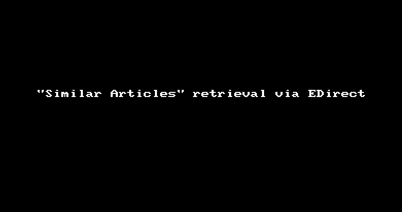

# Tools {#sec-tools}

## citationchaser {#sec-citationchaser}

**citationchaser** is a free tool for [citation searching](#sec-citationsearching). citationchaser is an [R package](https://github.com/nealhaddaway/citationchaser), deployed as a shinyapp at <https://estech.shinyapps.io/citationchaser/>. It uses the [Lens.org Scholarly API](https://www.lens.org/lens/user/subscriptions#scholar) for the retrieval of bibliographic information and for backward and forward citation searching.(@Haddaway2022b, @Haddaway2021)


## CRediT {#sec-credit}

The **Contributor Roles Taxonomy (CRediT)** is an American National Standard developed by the [National Information Standards Organization (NISO)](https://www.niso.org). See @NCWG2022 and <https://credit.niso.org/> for more information. It provides a convention for describing the contributions of authors in scholarly publications. (@Allen2019)

The idea behind the CRediT standard is to facilitate the recognition of author contributions and to make the authorship more transparent. When an article is submitted for publication, the contributions of each author can be described using the contributer roles described in the following table.

::: {#tbl-credit}

| Contributer Roles           | Definition                                                                                                                                                                                                       |
|:----------------------------|:-----------------------------------------------------------------------------------------------------------------------------------------------------------------------------------------------------------------|
| Conceptualization          | Ideas; formulation or evolution of overarching research goals and aims.                                                                                                                                         |
| Data curation              | Management activities to annotate (produce metadata), scrub data and maintain research data (including software code, where it is necessary for interpreting the data itself) for initial use and later re-use. |
| Formal analysis            | Application of statistical, mathematical, computational, or other formal techniques to analyze or synthesize study data.                                                                                        |
| Funding acquisition        | Acquisition of the financial support for the project leading to this publication.                                                                                                                               |
| Investigation              | Conducting a research and investigation process, specifically performing the experiments, or data/evidence collection.                                                                                          |
| Methodology                | Development or design of methodology; creation of models.                                                                                                                                                       |
| Project administration     | Management and coordination responsibility for the research activity planning and execution.                                                                                                                    |
| Resources                  | Provision of study materials, reagents, materials, patients, laboratory samples, animals, instrumentation, computing resources, or other analysis tools.                                                        |
| Software                   | Programming, software development; designing computer programs; implementation of the computer code and supporting algorithms; testing of existing code components.                                             |
| Supervision                | Oversight and leadership responsibility for the research activity planning and execution, including mentorship external to the core team.                                                                       |
| Validation                 | Verification, whether as a part of the activity or separate, of the overall replication/reproducibility of results/experiments and other research outputs.                                                      |
| Visualization              | Preparation, creation and/or presentation of the published work, specifically visualization/data presentation.                                                                                                  |
| Writing – original draft   | Preparation, creation and/or presentation of the published work, specifically writing the initial draft (including substantive translation).                                                                    |
| Writing – review & editing | Preparation, creation and/or presentation of the published work by those from the original research group, specifically critical review, commentary or revision - including pre- or post-publication stages     |
: Contributor roles as described in ANSI/NISO Z39.104-2022. {.striped}
:::

:::{.callout-tip title="Example for using CRediT"}
**Author Contributions**

**Jane Doe**: Conceptualization, Methodology, Software, Writing - review & editing. **John Smith**: Data curation, Writing - original draft. **Alex Miller**: Visualization, Investigation, Writing - original draft. **Max Headroom**: Supervision, Writing - reviewing & editing.
:::


## Entrez Programming Utilities {#sec-e-utilities}

The **Entrez Programming Utilities** (E-utilities) are a set of nine 
programs which provide an [API](https://en.wikipedia.org/wiki/API) to the 
[Entrez](#sec-entrez) database system of the NCBI. Comprehensive information 
about the E-utilifies is available in the official 
[E-utilities Help](https://www.ncbi.nlm.nih.gov/books/NBK25501/).

### E-utilities via URL
These programs are server-based and can be deployed using different URLs.
These URLs to query Entrez are composed of the base URL 
`https://eutils.ncbi.nlm.nih.gov/entrez/eutils/` to which a string with the 
desired utility and the query is attached, for instance 
[`esearch.fcgi?db=pubmed&term=BMJ[journal]+AND+hernia+AND+2010[pdat]`](https://eutils.ncbi.nlm.nih.gov/entrez/eutils/esearch.fcgi?db=pubmed&term=BMJ[journal]+AND+hernia+AND+2010[pdat])

The results for these queries are usually returned as XML-structured data.

### Entrez Direct

The E-utilities are also available directly on a 
[Unix shell](https://en.wikipedia.org/wiki/Unix_shell) under Linux or macOS by 
using the package [**Entrez Direct**](https://www.ncbi.nlm.nih.gov/books/NBK179288/) (EDirect). 

One of the main advantages of EDirect are the 
[commands](https://www.freecodecamp.org/news/the-linux-commands-handbook/) 
that are available on the shell, for example `grep`, `sort`, `uniq` or `wc`, 
which allow the results to be processed directly. Also shell scripts can be used
to automate the processing.

:::{.callout-tip title="Example: Retrieve similar articles"}
The command 

```bash
elink -db pubmed -id 25554246,29463298 -related -cmd neighbor 
| xtract -pattern LinkSetDb -element Id
```

will return all [PMIDs](#sec-pmid-pmcid) of publications which PubMed identifies
as [*Similar Articles*](https://pubmed.ncbi.nlm.nih.gov/help/#similar-articles) 
for the PMIDs [25554246](https://pubmed.ncbi.nlm.nih.gov/?linkname=pubmed_pubmed&from_uid=25554246) 
and  [29463298](https://pubmed.ncbi.nlm.nih.gov/?linkname=pubmed_pubmed&from_uid=29463298).


{#fig-edirect}

On PubMed the Similar Articles search can be carried out for only one PMID at a
time, whereas using the E-utilities it is possible to search with many PMIDs in
a single query.
:::


:::{.callout-tip title="Unix Shell on Windows" collapse=true}
There is a quick and easy way to get access to Linux and its shell even when
one is running a (modern) Windows PC: The Windows Subsystem for Linux (WSL) 
provides an environment to install Linux from within Windows (10 or later).

For more on this, see

- [How to install Linux on Windows with WSL](https://learn.microsoft.com/en-us/windows/wsl/install)  
- [Library Carpentry: The Unix Shell](https://librarycarpentry.org/lc-shell/)  
:::


::: {.callout-tip title="EDirect-related resources" collapse="true"} 
- [NCBI Bookshelf](https://www.ncbi.nlm.nih.gov/books/NBK179288/) (@Kans2013)
- [The Insider's Guide to Accessing NLM Data](https://dataguide.nlm.nih.gov/classes/edirect-for-pubmed/samplecode1.html)
- [NCBI Hackathon: EDirect Cookbook](https://github.com/NCBI-Hackathons/EDirectCookbook)
- [cli4es - command line tools for expert searchers](https://github.com/knh11545/cli4es)
:::


## FINER {#sec-finer}
FINER is an acronym for the five criteria **feasible**, **interesting**, **novel**, **ethical** and **relevant** which can be used as guidance when formulating a good clinical research question. See @tbl-finer. (@Cummings2013)


::: {#tbl-finer}
|                 |                                 |
|:----------------|:--------------------------------|
| **feasible**    | The research question should not exceed the available resources, i.e. participants, expertise, time and money).   |
| **interesting** | The research question should in itself be interesting, not only to the researcher, but also to a broader public.  |
| **novel**       | The gain of knowledge and new information should be at the heart of the question. Research usually does not only reiterate already established data unless it is designed as a confirmatory study. |
| **ethical**     | Proper research has to be ethical and must not bear unacceptable risks for its participants.                      |
| **relevant**    | The expected impact of the research on scientific knowledge and clinical processes can be a good measurement parameter for the relevance.  |
: The FINER criteria {.striped}
:::


## GRADE {#sec-grade}

GRADE is short for *Grades of Recommendation, Assessment, Development, and Evaluation*. The GRADE approach provides guidance for rating quality of evidence and grading strength of recommendations in health care. (@Guyatt2011b) 

The GRADE approach is described in several publications (see info box below) developed by the [GRADE working group](http://www.gradeworkinggroup.org/), a collaboration of experts working in the field of evidence-based medicine. 

More information can be found in the online [GRADE book](https://book.gradepro.org/).

::: {.callout-note title="GRADE guidelines (in numeric order)" collapse="true"}

**Introductory articles**

1. Introduction and summary of findings tables (@Guyatt2011)
2. Framing the question and deciding on the importance of outcomes (@Guyatt2011h)
3. Rating the quality of evidence (@Balshem2011)

**Rating the quality of evidence**

4. Rating the quality of evidence -- study limitations (risk of bias) (@Guyatt2011g)
5. Rating the quality of evidence -- publication bias (@Guyatt2011f)
6. Rating the quality of evidence -- imprecision  (@Guyatt2011a)
7. Rating the quality of evidence -- inconsistency (@Guyatt2011e)
8. Rating the quality of evidence -- indirectness (@Guyatt2011d)
9. Rating up the quality of evidence (@Guyatt2011c)
10. Considering resource use and rating the quality of economic evidence (@Brunetti2013)

**Summarizing the evidence**

11. Making an overall rating of confidence in effect estimates for a single outcome and for all outcomes (@Guyatt2013c)
12. Preparing summary of findings tables -- binary outcomes (@Guyatt2013b)
13. Preparing summary of findings tables and evidence profiles -- continuous outcomes (@Guyatt2013a)

**Further guidelines**

14. Going from evidence to recommendations: the significance and presentation of recommendations (@Andrews2013a)
15. Going from evidence to recommendation -- determinants of a recommendation's direction and strength (@Andrews2013)
16. GRADE evidence to decision frameworks for tests in clinical practice and public health (@Schuenemann2016)
17. Assessing the risk of bias associated with missing participant outcome data in a body of evidence (@Guyatt2017)
18. How ROBINS-I and other tools to assess risk of bias in nonrandomized studies should be used to rate the certainty of a body of evidence (@Schuenemann2019a)
19. Assessing the certainty of evidence in the importance of outcomes or values and preferences -- risk of bias and indirectness (@Zhang2019a)
20. Assessing the certainty of evidence in the importance of outcomes or values and preferences -- inconsistency, imprecision, and other domains (@Zhang2019)
21. Guideline 21 - test accuracy
	1. Part 1. Study design, risk of bias, and indirectness in rating the certainty across a body of evidence for test accuracy (@Schuenemann2020a)
	2. Part 2. Test accuracy: inconsistency, imprecision, publication bias, and other domains for rating the certainty of evidence and presenting it in evidence profiles and summary of findings tables (@Schuenemann2020)
22. The GRADE approach for tests and strategies -- from test accuracy to patient-important outcomes and recommendations (@Schuenemann2019)
23. Considering cost-effectiveness evidence in moving from evidence to health-related recommendations (@Xie2023)
24. Optimizing the integration of randomized and non-randomized studies of interventions in evidence syntheses and health guidelines (@CuelloGarcia2022)
25. --
26. Informative statements to communicate the findings of systematic reviews of interventions (@Santesso2020)
27. How to calculate absolute effects for time-to-event outcomes in summary of findings tables and Evidence Profiles (@Skoetz2020)
28. Use of GRADE for the assessment of evidence about prognostic factors: rating certainty in identification of groups of patients with different absolute risks (@Foroutan2020)
29. Rating the certainty in time-to-event outcomes—Study limitations due to censoring of participants with missing data in intervention studies (@Goldkuhle2021)
30. The GRADE approach to assessing the certainty of modeled evidence -- An overview in the context of health decision-making (@Brozek2021)
31. Assessing the certainty across a body of evidence for comparative test accuracy (@Yang2021)
32. GRADE offers guidance on choosing targets of GRADE certainty of evidence ratings (@Zeng2021)
33. Addressing imprecision in a network meta-analysis (@BrignardelloPetersen2021)
34. Update on rating imprecision using a minimally contextualized approach (@Zeng2022)
35. Update on rating imprecision for assessing contextualized certainty of evidence and making decisions (@Schuenemann2022)
36. Updates to GRADE's approach to addressing inconsistency (@Guyatt2023)
37. Rating imprecision in a body of evidence on test accuracy (@Mustafa2024)
38. Updated guidance for rating up certainty of evidence due to a dose-response gradient (@Murad2023)
39. Using GRADE-ADOLOPMENT to adopt, adapt or create contextualized recommendations from source guidelines and evidence syntheses (@Klugar2024)

:::


## PICO {#sec-pico}
PICO is an acronym for the four concepts **Population**, **Intervention**, **Comparison** 
and **Outcome**. Concepts like these are used for defining research questions as 
well as eligibility criteria for the studies relevant for answering the 
question.

::: {#tbl-pico}
|                   |                                                       |
|:------------------|:------------------------------------------------------|
| **Population**    | The patient group, problem or illness that should be diagnosed or treated as part of the study.   |
| **Intervention**  | The diagnostic or therapeutic action to be examined in the study.      |
| **Comparison**    | Diagnostic or therapeutic actions to compare the intervention with. This could be another established procedure, a placebo or no treatment at all.  |
| **Outcome**       | A measure of effect of the intervention.       |

: The PICO framework {.striped}
:::


There are other concepts and mnemonics for different kinds of research 
questions, such as SPIDER, ECLIPSE, PIRD or PICOS. (@Munn2018a, @Methley2014, 
@Eriksen2018)

## PRESS {#sec-press}
**Peer Review of Electronic Search Strategies (PRESS)** by @McGowan2016 is an 
evidence-based guideline for the peer review of search strategies. It is mainly 
focused on systematic review projects, health technology assesments (HTAs) and 
other kinds of reviews. A main tool for PRESS is a checklist which guides the 
reader through the process of peer review.

## PRISMA {#sec-prisma}

**Preferred Reporting Items for Systematic Reviews and Meta-Analyses (PRISMA)**
by @Page2021a is a set of minimum requirements for the reporting and 
documentation of systematic reviews. The goal of PRISMA is to set standards for
reporting and in doing so increase the overall quality of systematic reviews. 
A detailed explanatory paper was published by @Page2021b.

PRISMA also provides tools such as a checklist and a flowchart, which can be 
used for creating the recommended tables and figures for publication. 
(@rethlefsen_page_2021)

There are additional extensions of PRISMA for various purposes, such as 
PRISMA-S for the documentation of systematic literature searches 
(@Rethlefsen2021) or PRISMA-ScR for scoping reviews (@Tricco2018).

See also <https://prisma-statement.org>.


## PubReMiner {#sec-pubreminer}

The [**PubMed PubReMiner**](https://hgserver2.amc.nl/cgi-bin/miner/miner2.cgi) 
is an online tool that enables the user to extract information from the results 
of a [PubMed](#sec-pubmed) query.

Upon entering search terms (in valid [PubMed syntax](#sec-syntax)), PubReMiner 
summarizes the results of the query by creating tables with the following 
information:

- year of publication
- abbreviated journal name
- author
- free text terms
- MeSH terms
- substances
- publication type
- country

The tool can be used to extract data from a set of [seed papers](#sec-seedpaper)
simply by entering their PMIDs as a search query.

The PubReMiner is maintained by [Jan Koster](https://orcid.org/0000-0002-0890-7585) 
from the Amsterdam University Medical Centers (Amsterdam UMC).


## RAISE {#sec-raise}

RAISE is the abbreviation for **Responsible use of AI in evidence SynthEsis**,
which is a project for providing guidance regarding the responsible use of 
Artificial Intelligence in evidence synthesis. Currently, there are drafts of 
three core documents: 

- RAISE 1 - recommendations for practice
- RAISE 2 - building and evaluating AI evidence synthesis tools
- RAISE 3 - selecting and using AI evidence synthesis tools

See @Thomas2025 for more details and the current document versions. RAISE is
currently in preparation for peer-reviewed publication.


## Reference Management software {#sec-refmanagement}
Bibliographic records and similar sets of data such as clinical study metadata 
can be stored and managed using **reference management programs** (also called 
citation management software). 

These programs are usually able to perform tasks with the records, such as

- import and export of various formats (e.g. RIS, NBIB, BIB, TXT, CSV, XML)
- creation, editing and updating
- deduplication
- retrieval of full-texts
- output of citations in various styles

::: {#tbl-refmanagement}
| **Tool**  | **URL**                    | **Notes**            |
|:----------|:---------------------------|:---------------------|
| Citavi    | <https://www.citavi.com>   | fee-based            |
| EndNote   | <https://www.endnote.com>  | fee-based            |
| JabRef    | <https://www.jabref.org>   | free                 |
| Mendeley  | <https://www.mendeley.com> | limited free version |
| Zotero    | <https://www.zotero.org>   | free                 |
: Examples of reference management tools {.striped}
:::

For comparisons of reference management software see also <https://mediatum.ub.tum.de/1320978> and <https://en.wikipedia.org/wiki/Comparison_of_reference_management_software>.

## screening tools {#sec-screeningtools}

The screening of records to classify them according to previously defined 
[eligibility criteria](#sec-eligibilitycriteria) is a laborious task. 

Tools have been developed which allow the management of references for this 
particular task. They offer various features to accelerate or facilitate the
selection process, such as deduplication, keyword highlighting, AI-based sorting 
or automated exclusion of records. 

The following table lists a few of those tools:

::: {#tbl-screeningtools}
| **Tool**    | **URL**                    | **Notes**                             |
|:------------|:---------------------------|:--------------------------------------|
| Abstrackr   | <https://abstrackr.com>    | free of charge                        |
| ASReview    | <https://asreview.nl>      | free of charge, requires installation |
| Catchii     | <https://catchii.org>      | free of charge                        |
| colandr     | <https://www.colandrapp.com> | free of charge                      |
| Covidence   | <https://covidence.org>    | fee-based, free trial project         |
| PICO Portal | <https://picoportal.org>   | fee-based, free trial project         |
| rayyan      | <https://www.rayyan.ai>    | fee-based, 3 review projects are free |
| TERA        | <https://tera-tools.com>   | free of charge                        |
: Different screening tools {.striped}
:::

See also: @Carey2022, @Bruin2025, @Halman2024, @KahiliHeede2021, @Ouzzani2016

## searchbuildR {#sec-searchbuildr}
[**searchbuildR**](https://github.com/IQWiG/searchbuildR) is a tool written 
in [R](https://www.r-project.org/). Its purpose is to support 
the development of [search strategies](#sec-searchstrategy) by identifing search 
terms from a set of [seed papers](#sec-seedpaper).(@Kapp2024)

searchbuildR takes a set of references (e.g. as a RIS file) as input and 
identifies terms, which are overrepresented within this set compared with a 
large corpus of PubMed references.

:::{.callout-tip title="Installing and Running searchbuildR"}
searchbuildR is an R package, which can be installed from GitHub and run locally as a Shiny App in R:

```{r}
#| eval: false # Do not evaluate this chunk
#| echo: true # Do show this chunk in the final rendered document
#| output: false # Do not show the output / results of this chunk in the rendered document

# install and load the "remotes" package which is required to install remotely from github
install.packages("remotes")
library(remotes)

# install and load the searchbuildR package
remotes::install_github("https://github.com/IQWiG/searchbuildR")
library(searchbuildR)

# run the shiny app
run_app()
```
:::

searchbuildR is developed and maintained by [IQWiG](https://www.iqwig.de/en/presse/press-releases/press-releases-detailpage_121282.html).

## TARCiS {#sec-tarcis}
The [**TARCiS Statement**](https://tarcis.unibas.ch/) by @Hirt2024
provides guidance on **T**erminology, **A**pplications, and the **R**eporting 
of **Ci**tation **S**earching in the context of 
[systematic searching](#sec-syslitsearching). It offers recommendations as well
as a checklist for the most imporant items required to report in a review.
Please refer to the section on [citation searching](#sec-citationsearching) for 
more information about the techniques.

## Yale MeSH Analyzer {#sec-yalemeshanalyzer}
The [**Yale MeSH Analyzer**](https://mesh.med.yale.edu/) is an online tool for 
analyzing the bibliographic information of up to 20 
[PubMed](#sec-pubmed) records at once. It can be used to identify relevant 
search terms from the a set of [seed papers](#sec-seedpapers).

In principle, upon entering [PMIDs](#sec-pmid-pmcid) into the tool, it creates 
a summary table containing [MeSH terms](#sec-indexterms) and 
[author keywords](#sec-authorkeywords) for each publication
(see @tbl-yalemeshanalyzer).

::: {#tbl-yalemeshanalyzer}
| PMID            | 38644158                                                                                                                                                      | 30916023                                                                                                                                   | 38093118                                                                                                                                                                |
|:----------------|:--------------------------------------------------------------------------------------------------------------------------------------------------------------|:-------------------------------------------------------------------------------------------------------------------------------------------|:------------------------------------------------------------------------------------------------------------------------------------------------------------------------|
| **Title**           | Ventilatory efficiency as a prognostic factor for postoperative...                                                                                            | Ventilatory inefficiency adversely affects outcomes and longer-...                                                                         | A retrospective analysis of the association of effort-independe...                                                                                                      |
| **Author (Year)**   | Vetsch T (2024)                                                                                                                                               | Wilson RJT (2019)                                                                                                                          | Franssen RFW (2023)                                                                                                                                                     |
| **MeSH Headings**  |                                                                                                                                                               | Aged <br>  Aged, 80 and over                                                                                                                     | Aged                                                                                                                                                                    |
|                 |                                                                                                                                                               | Carbon Dioxide / me <br>  Colorectal Neoplasms / pp <br> Colorectal Neoplasms / su*                                                                   | Colorectal Surgery*                                                                                                                                                     |
|                 | Elective Surgical Procedures* / ae <br> Exercise Test / mt                                                                                                    | Exercise Test / mt* <br>  Exercise Tolerance                                                                                               | Exercise Test                                                                                                                                                           |
|                 |                                                                                                                                                               | Female                                                                                                                                     | Female                                                                                                                                                                  |
|                 | Humans                                                                                                                                                        | Humans                                                                                                                                     | Heart Failure* <br> Humans                                                                                                                                                   |
|                 |                                                                                                                                                               | Lung / pp*                                                                                                                                 |                                                                                                                                                                         |
|                 |                                                                                                                                                               | Male                                                                                                                                       | Male                                                                                                                                                                    |
|                 |                                                                                                                                                               | Oxygen Consumption / ph                                                                                                                    | Oxygen Consumption                                                                                                                                                      |
|                 | Postoperative Complications* / ep <br>  Prognosis                                                                                                                   | Postoperative Complications / di <br> Postoperative Complications / ep* <br> Postoperative Complications / pp <br> Pulmonary Ventilation / ph*            | Postoperative Complications / ep <br> Prognosis                                                                                                                              |
|                 |                                                                                                                                                               | Retrospective Studies <br> Risk Factors                                                                                                         | Retrospective Studies                                                                                                                                                   |
|                 |                                                                                                                                                               | Survival Analysis                                                                                                                          |                                                                                                                                                                         |
|                 |                                                                                                                                                               | United Kingdom / ep                                                                                                                        |                                                                                                                                                                         |
| **Author Keywords** | VE/VCO(2) <br> exercise testing <br> major surgery <br> postoperative complications <br> postoperative mortality <br> prediction models <br> preoperative assessment <br> ventilatory efficiency | cardiopulmonary exercise testing <br> colorectal surgery <br>  mortality <br> perioperative risk factors <br>  pre-operative evaluation <br> ventilatory inefficiency | Abdominal surgery <br> Anaerobic threshold <br> Cardiopulmonary exercise testing <br> Oxygen uptake efficiency slope <br> Peak oxygen uptake <br> Preoperative care <br> Preoperative risk assessment |
: Example of a table created by the Yale MeSH Analyzer {.hover}
:::

The Yale MeSH Analyzer is maintained by the 
[Cushing/Whitney Medical Library](https://library.medicine.yale.edu/) at 
Yale University.